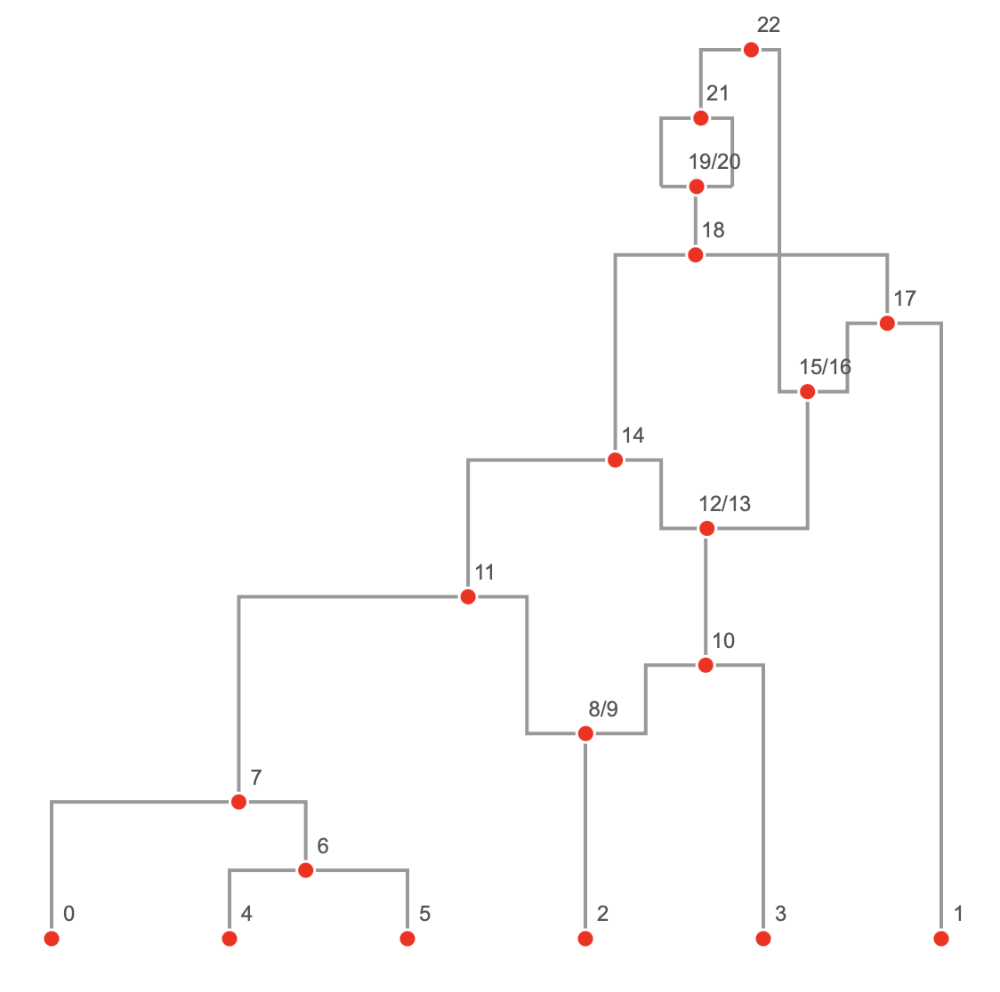

# Ancestral Recombination Graph Visualizer

  

A method for drawing ancestral recombination graphs from tskit tree sequences in Python using D3.js.

**Python Dependencies**: jupyter, msprime, numpy
**JavaScript Dependencies**: D3 (loaded from CDN)

## Files

- **arg_visualizer.ipynb**: Jupyter Notebook with Python code for creating data.js and viewing the plot
- **data.js**: JavaScript file with all of the ARG data for plotting (ugly, but simple method to pass data from Python into JavaScript)
- **visualizer.html**: HTML file for plotting using JavaScript alongside CSS styles

The arg_visualizer.ipynb writes to data.js which is called by visualizer.html. An IFrame of visualizer.html is displayed in arg_visualizer.ipynb. Users only need to open the Jupyter Notebook to run the code for themselves.

## Explanation of Plotting Method

The following information is provided to D3.js in the JSON object.

- **Nodes**
  - **id**: unique identifier of each node
  - **label**: the node label when plotting (matches the id unless the node is a recombination node when it merges the two tskit node ids together)
  - **flag**: msprime node flag
  - **time**: time of the node from tskit
  - **fy**: fixed y position in the plot relating to their age
  - *optional*
    - **fx**: fixed x position in the plot (used for sample nodes)
    - **x_pos_reference**: the id of another node that should be used to determine the x position of this node (not yet implemented as it breaks the force simulation)

- **Links**
  - **source**: parent node
  - **target**: child node
  - *optional*
    - **direction_reference**: the id of the alternative parent for recombination nodes

ARGs are plotted using a D3's [force layout](https://github.com/d3/d3-force). All nodes have a fixed position on the y-axis set by fy. Sample nodes have a fixed position on the x-axis set by fx; the ordering of the sample nodes comes from the first tree in the tskit tree sequence (this is not always the optimal ordering but is generally a good starting point for plotting). The x positions of other nodes are set by a force simulation where all nodes repel each other countered by a linkage force between connected nodes in the graph.

Users can click and drag the nodes (including the sample) along the x-axis to further clean up the layout of the graph. The simulation does not take into account line crosses, which can often be improved with some fiddling. Once a node has been moved by a user, its position is fixed with regards to the force simulation.
