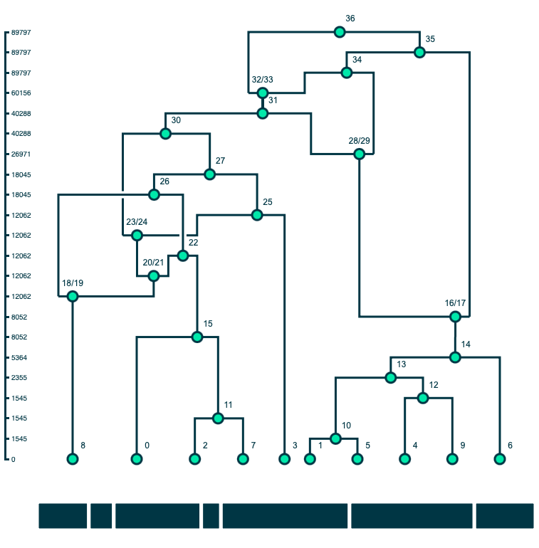

# Ancestral Recombination Graph Visualizer

<p align="center">
  
</p>

A method for drawing ancestral recombination graphs from tskit tree sequences in Python using D3.js.

## Quickstart

Clone this repository and ensure that dependencies are installed.

  * **Python Dependencies**: msprime, numpy

  * **JavaScript Dependencies**: D3 (loaded from CDN, so you must have connection to internet)

Open terminal, move into the tskit_arg_visualizer directory, and run:

```
python example.py
```

This will launch a web browser with your plotted ARG.

## Drawing Parameters

The `draw()` function for a `D3ARG` object has multiple parameters that give users a small amount of customization with their figures:

```
def draw(
    self,
    width=500,
    height=500,
    tree_highlighting=True,
    y_axis_labels=True,
    y_axis_scale="rank",
    line_type="line",
    subset_nodes=None
):
"""Draws the D3ARG using D3.js by sending a custom JSON object to visualizer.js 

Parameters
----------
width : int
    Width of the force layout graph plot in pixels (default=500)
height : int
    Height of the force layout graph plot in pixels (default=500)
tree_highlighting : bool
    Include the interactive chromosome at the bottom of the figure to
    to let users highlight trees in the ARG (default=True)
y_axis_labels : bool
    Includes labelled y-axis on the left of the figure (default=True)
y_axis_scale : string
    Scale used for the positioning nodes along the y-axis. Options:
        "rank" (default) - equal vertical spacing between nodes
        "time" - vertical spacing is proportional to the time
        "log_time" - proportional to the log of time
edge_type : string
    Pathing type for edges between nodes. Options:
        "line" (default) - simple straight lines between the nodes
        "ortho" - custom pathing (see pathing.md for more details, should only be used with full ARGs)
subset_nodes : list (EXPERIMENTAL)
    List of nodes that user wants to stand out within the ARG. These nodes and the edges between them
    will have full opacity; other nodes will be faint (default=None, parameter is ignored and all
    nodes will have opacity)
"""
```

A quick note about line_type="ortho" (more details can be found within pathing.md) - this parameter identifies node types based on msprime flags and applies pathing rules following those types. Because of this, "ortho" should only be used for full ARGs with proper msprime flags. Other tree sequences, including simplified tree sequences (those without marked recombination nodes marked) should use the "line" line_type.

## Saving Figures

Each figure is actually just a JSON object that D3.js interprets and plots to the screen (see plotting.md for more information about this object **TODO**). The "Copy Source To Clipboard" button to the top left of each figure copies that specific figure's JSON object to your computer's clipboard. This object includes all of the information needed to replicate the figure in a subsequent simulation and can be pasted into a `.json` file for later. To revisualize this figure:

```
import json
from visualizer import visualizer

arg_json = json.load(open("example.json", "r"))
visualizer.draw_D3(arg_json=arg_json)
```

## Reheating A Figure (EXPERIMENTAL)

The energy of the force layout simulation reduces overtime, causing the nodes to lose speed and settle into positions. Additionally, anytime the user moves a node by dragging, its new position becomes fixed and there on out unchanged by the simulation. The "Reheat Simulation" button in the top left of each figure unfixes the positions of all nodes except for the sample nodes at the tips, and gives a burst of energy to the simulation to allow the nodes to find new optimal positions. This feature is most useful when the starting sample node positions are not optimal; the user can rearrange them and then reheat the simulation to see if that helps with untangling.